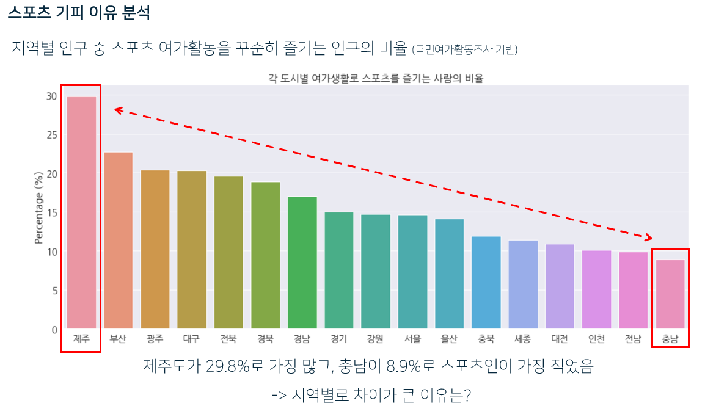
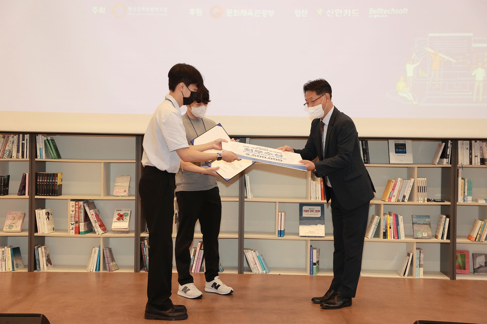

# [Project] 2022 문화·관광 빅데이터 분석대회

- Team: DATA 133
- Title: 스포츠 활동 및 산업 활성화 방안
- Member: 손동현, 이재용 (Leader)
- While: 2022/06/15 - 2022/08/25
- Final Rank: 최우수상 (한국문화관광연구원 원장상)

> 스포츠 관련 데이터 분석을 통해 수요 증대 방안을 모색

## 역할

- EDA : 국민여가활동조사 데이터 EDA, 상관관계 검토 등
- 전처리 : 분류모형 활용
- 분류 모형 모델링 : 분류 모형을 위한 피처 선정 및 모델 훈련
- 피처 생성 : 추천시스템에 활용할 피처 아이디어 제안 및 피처 생성
- 추천시스템 모델링 : 추천시스템 모형 실험
- PPT 자료 취합 및 작성
- 발표 자료 작성 및 발표

## 프로젝트 배경

- 스포츠 활동은 국민의 건강 증진과 복지 측면에서 꾸준히 수요가 증가하였고, 정부 차원에서도 과거, 현재 정부를 가리지 않고 강조되어 온 활동임
- 특히, MZ세대는 웨이트트레이닝을 비롯하여 골프, 테니스, 클라이밍 등 취미 여가활동으로 스포츠 여가활동에 대한 관심을 꾸준히 보여옴
- 하지만 코로나 19 사태로 인하여, 2019년 생활체육 참여율은 66.6%에서 2021년 60.8%로 떨어지는 등 생활체육 참여율 자체는 많이 감소하여 회복되지 못하였음
- 스포츠 여가활동 참여율을 이전 수준으로 다시 증가시킬 방법을 모색하기 위해 스포츠 관련 데이터를 분석

## 데이터 셋

1. 국민여가활동조사 (2021)
    
    출처 - [🔗link - 문화예술지식정보시스템](https://policydb.kcti.re.kr/#/surveyLeisure4?bbstypecd=3003013&poststatcd=1400)
    
    크기 - 10,049명에게 조사한 356개 칼럼
    
    특징 - 여가활동 관련 설문조사 응답 데이터
    
2. 신한카드 데이터
    
    출처 - 대회 주최 측 제공
    
    크기 - 50,905,131 행 x 12 칼럼
    
    특징 - 거주지, 성별, 연령대, 구매 카테고리 별로 사용 금액과 사용 건수가 집계화된 데이터
    
3. 전국체육시설 상세 정보 데이터 (2022)
    
    출처 - [🔗link - 공공데이터 포털](https://www.data.go.kr/data/15096288/standard.do)
    
    크기 - 7,306 행 x 7 칼럼
    
    특징 - 체육시설의 위치를 시도, 시군구, 동읍면 단위로 경도와 위도를 표현한 데이터
    

## 기술 스택

    
    
    
    
    
    

## 프로젝트 진행 단계

1. 데이터 EDA 및 인사이트 발굴
2. 분석 과제 결정
3. 데이터 전처리
4. 모형 생성 및 피처 선정
5. 추천시스템 개발용 데이터 수집
6. 추천시스템 활용 피처 생성
7. 추천시스템 모형 생성
8. 추가 데이터 활용 시각화
9. 결과 정리 및 최종 보고 PPT 작성
10. 발표 자료 작성 및 발표

## 프로젝트 세부 과정

1. EDA 및 인사이트 발굴
    
    스포츠 수요 증대 방안을 탐색하기 위해 국민여가활동조사 데이터로 EDA를 진행
    
    - 스포츠 여가활동 경험과 스포츠 여가활동 희망 여부 사이의 상관관계를 확인
        
        → 스포츠 경험자가 스포츠 여가활동 희망확률이 높다는 점에서 메인 아이디어 발굴
        

1. 분석 과제 결정
    1. 스포츠 비경험자에게는 스포츠 경험을 유도하여 스포츠 여가활동 희망확률을 높일 것
    2. 스포츠 경험을 유도하기 위해 스포츠 경험자의 특성을 활용한 추천시스템을 개발
    3. 스포츠활동 기피 이유 추가 분석

1. 데이터 전처리
    1. 스포츠 경험자/비경험자 칼럼 생성
    2. 최적의 변수선택을 위한 칼럼 추출 및 카드 데이터에 없는 나이대 행 삭제

1. 분류 모형 생성 및 피처 선정
    1. 이진 분류모형 생성 (랜덤포레스트, 그래디언트 부스팅)
    2. 그리드 서치 진행
        1. 랜덤포레스트 : 트리 개수, 트리 최대 깊이, 리프노드의 최소 표본, 분할 샘플 수 등을 세분화하여 실험
        2. 그래디언트 부스팅: 트리 개수, 트리 최대 깊이, 학습률, 최대 피처 수 등을 세분화하여 실험
    3. 분류 정확도 확인
        
        그리드 서치 결과 분류 정확도가 높은 분류모형의 하이퍼파라미터 선택
        
        - 그래디언트 부스팅 모형 선정 (Accuracy : 0.737)
        - learning rate = 0.7
        - max_depth = 4
        - max_features = 1
        - n_estimators = 15
    4. 변수 중요도 확인하여 주요 피처 선정
        
        “성별”, “거주지”
        

1. 추천시스템 개발용 데이터 수집
    - 개인화된 스포츠 추천시스템 개발하여 비경험자에게 맞춤형 스포츨르 추천하고자 함
    - **Problem 1 :** 데이터의 한계로, 추천시스템의 평점으로 활용할 변수가 적절히 존재하지 않았음
        - 국민여가활동지수의 만족도 지표는 만족/매우 만족으로의 편향이 심각하여 평점으로 활용하기 어려웠음
        
        → 만족도 지표를 대체할 지표로 신한카드에서 제공한 스포츠 카테고리의 “**평균취급액**” 지표를 개발하여 사용
        
        - 가정 : 카드 평균 취급액이 높은 스포츠일수록 만족도가 높아서 소비액이 높다
    - 신한카드 데이터 활용 EDA 진행
    - 피처 활용 방법 고민

1. 추천시스템에 사용할 피처 생성
    - **Problem 2** : 추천시스템은 개인화된 추천을 위한 알고리즘이나, 카드사에서 주어진 데이터가 개별 사용자 단위로 주어지지 않은 집계화된 데이터였음
        
        → 거주지, 성별, 연령을 군집으로 묶어 하나의 개인 사용자인 것으로 가정하고 추천시스템에 적용
        
    1. 인구 특성별로 집계된 총 소비금액과 총 구매건수를 사용하여 평균취급액 변수 생성
    2. 평균취급액을 구간화하여 평점 변수 생성

1. 추천시스템 모형 생성
    - 추천시스템 모형 생성: 특이값 분해 (SVD), KNN Baseline 모형
    - 그리드 서치 진행
        - SVD: n_factors, lr_all_reg_all
        - KNN Baseline : 이웃 수, 유사성 척도, 최소 공통 아이템 개수,
    - 평점 변수의 RMSE 확인하여 오차값이 더 낮은 모형의 최적의 하이퍼파라미터 선택
        - KNN Baseline 모형 선정 (RMSE : 0.735)
        - 유사성 척도 = pearson_baseline
        - k = 28
        - min_support = 1

1. 추가 데이터 활용 시각화
    
    스포츠 기피 이유 분석을 위한 시각화 진행
    - 체육시설의 차이를 원인으로 판단하고 추가 시각화 요청

1. 결과 정리 및 PPT 작성
    - PPT 템플릿 작성, PPT 자료 취합 및 내용 작성

1. 발표 자료 작성 및 발표
    - 발표 담당하여 발표 진행
        
        
        

## 프로젝트 결과

1. 스포츠 경험 여부와 스포츠 여가활동 희망 여부 사이의 유의한 연관성 확인
2. 스포츠경험자/비경험자를 분류하는 중요한 변수로는 “성별”, “거주지”가 주요한 피처로 작용
3. 스포츠 경험자의 특징을 이용한 추천 알고리즘의 적용 가능성을 확인
4. 스포츠 추천시스템을 활용한 스포츠 여가활동 수요 증대 기대
- 최우수상 수상
    
    
    

## 프로젝트 회고

1. 잘한 점
    1. 데이터의 한계점을 극복하기 위한 메인 아이디어 제안
    2. 피처 생성 아이디어 과정을 가정을 통해 설득력 있게 풀어간 점
    3. 전반적인 분석을 기획하고 프로세스를 고안한 점

1. 한계점
    1. 가정의 한계
        
        데이터의 한계를 가정을 통해 설명하였으나, 가정이 잘못된 가정일 경우 어긋난 결과를 도출할 수 있음
        
        → 데이터의 한계를 대체하기 위해 발생했던 한계점으로 실제 개인화된 데이터를 구한다면 해결 가능
        
    2. 가정에서 놓친 점
        
        가정 중 스포츠에 사용한 금액이 높을 수록 해당 스포츠를 좋아한다는 가정을 사용
        
        하지만, 스포츠 특성 상 돈이 많이 들 수 밖에 없는 것들이 있음 (ex. 골프)
        
        → 스포츠별로 금액에 대한 표준화를 진행하여 구간화하였다면 조금 더 스포츠별 특성을 고려한 평점화가 가능했을 것으로 보임
# Further Description

- Follow link below:
(https://thon-profile.notion.site/Project-2022-739d51029cd949449519f41483f41e14)
